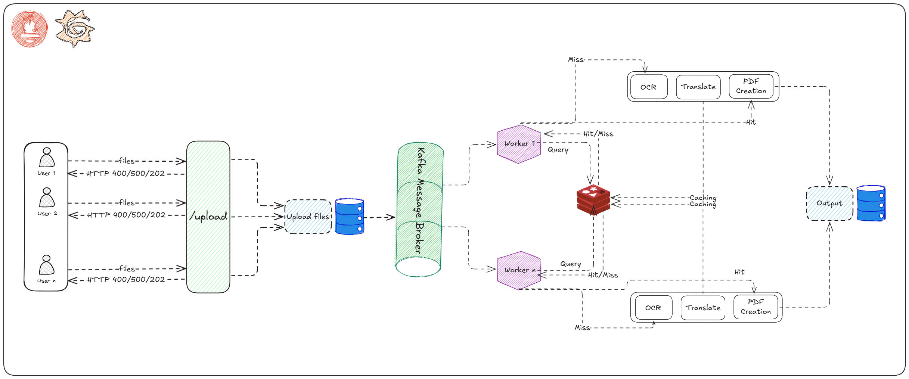

# Dự án Xử lý Ảnh OCR và Dịch Thuật (INT3105 - Software Architecture Project)

## 1. Mô tả Dự án

Dự án hướng tới xây dựng một hệ thống có khả năng tiếp nhận file ảnh, thực hiện Nhận dạng Ký tự Quang học (OCR) để trích xuất văn bản, dịch văn bản đó sang tiếng Việt, và cuối cùng tạo ra một file PDF chứa văn bản đã dịch. Hệ thống được thiết kế với kiến trúc microservices, sử dụng Kafka để xử lý bất đồng bộ và Redis cho việc caching, cùng với bộ công cụ giám sát Prometheus và Grafana.

## 2. Các Nhiệm Vụ Đã Hoàn Thành

*   **Tiếp nhận File:**
    *   Xây dựng API endpoint (`/upload`) để người dùng có thể tải lên một hoặc nhiều file ảnh.
    *   Lưu trữ file tạm thời trên server.
*   **Xây dựng UI:** Xây dựng Web UI cho phép tải lên nhiều files khác nhau và nhận về files sau khi xử lý của chúng một cách trực quan, dễ nhìn với *HTML* và *CSS*.
*   **Pipeline Xử lý Bất đồng bộ với Kafka:**
    *   Triển khai Kafka làm message broker.
    *   Service `app` (producer) gửi thông tin file cần xử lý vào một topic Kafka.
    *   Service `worker` (consumer) lắng nghe topic Kafka để nhận và xử lý file.
*   **Xử lý Ảnh và Văn bản (Worker Service):**
    *   **OCR:** Tích hợp thư viện OCR (ví dụ: Tesseract.js) để trích xuất văn bản từ ảnh.
    *   **Dịch thuật:** Tích hợp API hoặc thư viện dịch thuật (ví dụ: Google Translate API) để dịch văn bản đã OCR.
    *   **Tạo PDF:** Tạo file PDF từ văn bản đã được dịch.
*   **Caching với Redis:**
    *   Triển khai Redis để cache kết quả xử lý (văn bản OCR và văn bản dịch) dựa trên hash của nội dung file.
    *   Giảm thiểu việc xử lý lặp lại cho các file giống hệt nhau, cải thiện hiệu năng.
*   **Giám sát Hệ thống (Monitoring):**
    *   Tích hợp Prometheus để thu thập metrics từ các service (`app` và `worker`).
    *   Các metrics chính được theo dõi:
        *   Số lượng file được xử lý.
        *   Thời gian xử lý của từng giai đoạn (OCR, Dịch thuật, Tạo PDF).
        *   Tổng thời gian xử lý.
        *   Tỷ lệ Cache Hit/Miss.
        *   Tỷ lệ lỗi xử lý.
        *   Sử dụng tài nguyên (CPU, Memory) của các service.
    *   Xây dựng Dashboard Grafana (`ocr-app-dashboard.json`) để trực quan hóa các metrics thu thập được.
*   **Kiểm thử Tải (Load Testing):**
    *   Xây dựng kịch bản kiểm thử tải bằng Grafana K6 (`test/load-test.js`) để đánh giá hiệu năng và khả năng chịu tải của hệ thống (Bao gồm 4 kịch bản kiểm thử: Kiểm thử cơ bản, Kiểm thử tải tăng dần, Kiểm thử sức tải (Stress test), Kiểm thử ngâm)
*   **Containerization với Docker:**
    *   Docker hóa các thành phần của hệ thống (Kafka, Zookeeper, Control Center, Redis, Prometheus, Grafana, và ứng dụng Node.js `worker`).
    *   Sử dụng Docker Compose (`docker-compose.yml`) để quản lý và khởi chạy toàn bộ hệ thống một cách dễ dàng.
*   **Tối ưu hóa:**
    *   Tối ưu số lượng "filter" (worker instances) để phù hợp với hạ tầng phần cứng. Ở đây, thông qua việc *containering worker*, nhóm đã tạo điều kiện ở ứng với các hạ tầng phần cứng khác nhau, thì có thể triển khai khác nhau thông qua cú pháp Docker Compose, thay vì cố định cứng (**n** tùy chọn, như ở dưới):
        ```bash
        docker-compose up --scale worker=n --build
        ```

## 2.1. Quá Trình Phát Triển Kiến Trúc và Các Phiên Bản

Dự án được phát triển qua nhiều giai đoạn, với mỗi giai đoạn tập trung vào việc cải tiến và hoàn thiện kiến trúc hệ thống. Quá trình này được ghi nhận qua các nhánh (branch) riêng biệt trong repository, mỗi nhánh đại diện cho một bước tiến trong thiết kế và triển khai:

*   **Nhánh `basic_architecture` (Kiến trúc Nền tảng):**
    *   Đây là phiên bản khởi đầu của dự án, hiện thực hóa ý tưởng cốt lõi với một kiến trúc đồng bộ. Quy trình xử lý ảnh bao gồm OCR, dịch thuật và tạo PDF được thực thi tuần tự và trực tiếp ngay sau khi người dùng gọi API `/upload`.
    *   Điểm nổi bật của nhánh này là việc tích hợp một giao diện người dùng đơn giản, cho phép tương tác trực quan với hệ thống.
    *   Mặc dù đáp ứng được yêu cầu chức năng cơ bản, kiến trúc này bộc lộ những hạn chế về khả năng mở rộng và hiệu năng khi xử lý số lượng lớn yêu cầu đồng thời, do tính chất blocking của việc xử lý trực tiếp tại API.

*   **Nhánh `message_queue` (Tích hợp Hàng đợi Tin nhắn):**
    *   Để giải quyết những thách thức của kiến trúc nền tảng, nhánh này giới thiệu một sự thay đổi kiến trúc quan trọng: áp dụng mô hình Message Broker với Apache Kafka.
    *   Công việc xử lý ảnh (OCR, dịch thuật, PDF) được tách rời hoàn toàn khỏi luồng xử lý chính của API `/upload`. Thay vào đó, `App Service` chỉ đóng vai trò tiếp nhận yêu cầu và gửi thông điệp chứa thông tin file cần xử lý vào một hàng đợi Kafka.
    *   Một `Worker Service` độc lập (hoặc nhiều instances) sẽ lắng nghe hàng đợi này, nhận các thông điệp và thực hiện các tác vụ xử lý nặng một cách bất đồng bộ.
    *   Kiến trúc này mang lại lợi ích vượt trội về khả năng chịu lỗi, khả năng mở rộng (bằng cách tăng số lượng worker), và cải thiện đáng kể thời gian phản hồi của API `/upload` do không còn phải chờ đợi các tác vụ tốn thời gian.

*   **Nhánh `cache` (Tối ưu hóa với Caching):**
    *   Xây dựng trên nền tảng kiến trúc `message_queue`, nhánh `cache` tập trung vào việc tối ưu hóa hiệu năng hơn nữa bằng cách triển khai cơ chế caching với Redis.
    *   Trước khi thực hiện các tác vụ OCR và dịch thuật tốn kém, `Worker Service` sẽ kiểm tra xem nội dung file (dựa trên mã hash của file) đã từng được xử lý và lưu trữ trong Redis hay chưa.
    *   Nếu tìm thấy trong cache (cache hit), kết quả sẽ được sử dụng lại ngay lập tức, bỏ qua các bước xử lý nặng. Điều này giúp giảm thiểu đáng kể thời gian xử lý cho các file trùng lặp và giảm tải cho hệ thống.

*   **Nhánh `filter_scaling` (Tối ưu hóa với số lượng Workers chạy cùng lúc):**
    * Thông qua việc triển khai *containerizing*, cho phép nhóm tạo tiền đề linh hoạt trong số lượng *Workers* có thể chạy cùng lúc thay vì cố định cứng.

* **Nhánh Web (Triển khai với HTML và CSS):**
    * Nhánh Web là phiên bản UI của Kiến trúc cơ bản, cho việc tải nhiều files và nhận về các files đó đã qua xử lý. Việc trực quan hóa giúp dễ dàng trong việc sử dụng. Song hạn chế là chưa triển khai UI với phiên bản kiến trúc tốt nhất là `filter_scaling`

**Giám sát và So sánh Hiệu năng:**
Một khía cạnh quan trọng trong quá trình phát triển là việc triển khai cơ chế giám sát (sử dụng Prometheus và Grafana) cho cả 4 phiên bản kiến trúc. Điều này cho phép nhóm thực hiện các kịch bản kiểm thử tải (load testing) một cách nhất quán và thu thập dữ liệu hiệu năng chi tiết. Từ đó, nhóm có thể đưa ra những so sánh tường minh về ưu nhược điểm của từng kiến trúc, đánh giá hiệu quả của các giải pháp cải tiến và đưa ra quyết định dựa trên dữ liệu thực tế.

## 3. Kiến trúc Triển Khai Hiện Tại (Message Queue, Cache và Multiple Workers)

Phần dưới đây mô tả chi tiết kiến trúc hệ thống đã được hoàn thiện và tối ưu nhất, tương ứng với sự kết hợp của các ý tưởng từ nhánh `message_queue` và `cache` lẫn `Multiple Workers`. Sơ đồ và luồng hoạt động thể hiện cách các thành phần tương tác trong một môi trường được quản lý bởi Docker Compose, tận dụng Kafka cho xử lý bất đồng bộ và Redis cho caching.



**Luồng hoạt động chính:**

1.  **Upload:** Người dùng tải file ảnh lên `App Service`.
2.  **Queueing:** `App Service` lưu file vào một thư mục chia sẻ (ví dụ: `uploads/`) và gửi một message chứa tên file (hoặc đường dẫn) vào topic `received_files` trên Kafka.
3.  **Processing:** `Worker Service` (một hoặc nhiều instance) consume message từ Kafka.
4.  **Cache Check:** Worker kiểm tra Redis cache xem file này (dựa trên hash nội dung) đã được xử lý trước đó chưa.
    *   **Cache Hit:** Nếu có, lấy kết quả từ cache.
    *   **Cache Miss:** Nếu không, worker đọc file từ thư mục `uploads/`.
5.  **Core Logic (nếu Cache Miss):**
    *   Thực hiện OCR để trích xuất văn bản.
    *   Dịch văn bản sang ngôn ngữ đích.
    *   Lưu kết quả (văn bản OCR, văn bản dịch) vào Redis cache.
6.  **Output:** Tạo file PDF từ văn bản đã dịch. (Việc lưu trữ/trả về file PDF này cho người dùng cần được làm rõ thêm trong yêu cầu).
7.  **Monitoring:** Tất cả các service (`app`, `worker`, Kafka, Redis) đều expose metrics cho Prometheus. Grafana sử dụng Prometheus làm datasource để hiển thị dashboard.

## 4. Cách Sử Dụng

### 4.1. Yêu Cầu Hệ Thống

*   Docker
*   Docker Compose
*   Node.js và npm
*   Grafana k6 (Thực thi các kịch bản kiểm thử)

### 4.2. Khởi Chạy Hệ Thống

0. **Cài đặt các gói liên quan và tạo folder:**
    ```bash
    npm install
    mkdir uploads
    mkdir output
    ```

1.  **Xây dựng và khởi chạy các container Docker:**
    * Lưu ý: Số lượng thiết lập *worker* ở dưới chỉ phù với kiến trúc máy tính đang thực nghiệm. Tùy cấu hình khác nhau, có những điều chỉnh khác nhau.
    ```bash
    docker-compose up --scale worker=2 --build 
    ```
    Lệnh này sẽ xây dựng image cho `worker` và khởi chạy tất cả các service.

2.  **Kiểm tra trạng thái các container:**
    ```bash
    docker-compose ps
    ```
    Đảm bảo tất cả các service nên ở trạng thái `Up` hoặc `running`.

3.  **Tiếp tục khởi chạy Server (app.js):**
    ```bash
    npm start dev
    ```
    Lưu ý, Server chỉ có thể thực thi một cách trơn tru khi khởi tạo **Broker** ở docker-compose thành công.

### 4.3. Sử Dụng Chức Năng Upload

*   **Endpoint:** `POST http://localhost:5000/upload`
*   **Body:** `multipart/form-data`
*   **Field:** `files` (có thể upload một hoặc nhiều file)
*   **Ví dụ sử dụng `curl`:**
    ```bash
    curl -X POST -F "files=@/path/to/your/image1.jpg" -F "files=@/path/to/your/image2.png" http://localhost:5000/upload
    ```
*  Hoặc trực tiếp sử dụng ứng dụng **Postman**.   
    Sau khi upload, bạn có thể kiểm tra logs của `app` và `worker` để xem quá trình xử lý, với log của `app` xem ở Terminal.
    ```bash
    docker-compose logs -f worker
    ```
* Files ban đầu sẽ được tải lên Server ở thư mục `/uploads`, còn nội dung PDF sau đó sẽ được đẩy ra ở `/output`

### 4.4. Truy Cập Các Công Cụ Giám Sát

*   **Prometheus UI:** `http://localhost:9090`
    *   Có thể xem các target (Status -> Targets) và thực thi các truy vấn PromQL.
*   **Grafana UI:** `http://localhost:3000`
    *   Dashboard "OCR App Dashboard" sẽ được tự động provision do cấu hình trong `grafana/provisioning/dashboards/`.
*   **Confluent Control Center:** `http://localhost:9021`

### 4.5. Chạy Kiểm Thử Tải (k6)

1.  Đảm bảo hệ thống đang chạy (các service Docker Compose đã `up` và cả `NodeJS` server).
2.  Mở terminal mới, điều hướng đến thư mục gốc của dự án.
3. Lựa chọn kịch bản kiểm thử ở trong `load-test.js`, có 4 kịch bản, tương ứng với 4 mục đích khác nhau.
4.  Chạy lệnh:
    ```bash
    k6 run test/load-test.js
    ```
    Kết quả kiểm thử sẽ được hiển thị trên terminal. Hoặc có thể theo dõi các dashboard Grafana trong quá trình chạy tải để xem hệ thống phản ứng như thế nào.

### 4.6. Dừng Hệ Thống

```bash
docker-compose down
```
Lựa chọn xóa cả volumes (dữ liệu Kafka, Grafana, v.v.):
```bash
docker-compose down -v
```

## 5. So sánh hiệu năng

### 5.1 Mô tả kịch bản kiểm thử

| Kịch bản                                         | Loại kiểm thử                          | Mô tả                                                                                                                                                                                             | Mục đích                                                                                                                               |
| :----------------------------------------------- | :-------------------------------------- | :------------------------------------------------------------------------------------------------------------------------------------------------------------------------------------------------ | :------------------------------------------------------------------------------------------------------------------------------------- |
| 1                                                | Kiểm thử cơ bản                        | - Request per second: 1<br>- Duration: 5m<br>- preAllocatedVUs: 5<br>- maxVUs: 10                                                                                                                  | Thiết lập một đường cơ sở về hiệu suất của hệ thống dưới một tải trọng nhẹ và ổn định.                                                |
| 2                                                | Kiểm thử tải tăng dần (Ramp-up Load Test) | - StartVUs: 0<br>- Các giai đoạn tăng dần bao gồm:<br>  + { duration: \'2m\', target: 10 },<br>  + { duration: \'3m\', target: 10 },<br>  + { duration: \'2m\', target: 30 },<br>  + { duration: \'3m\', target: 30 },<br>  + { duration: \'2m\', target: 50 },<br>  + { duration: \'5m\', target: 50 },<br>  + { duration: \'2m\', target: 0 },<br>→ Total duration: 19m<br>→ MaxVUs: 50 (5m) | Xem hệ thống phản ứng như thế nào khi tải trọng tăng dần. Từ đó, giúp xác định điểm nghẽn cổ chai và giới hạn hiệu suất.                |
| 3                                                | Kiểm thử sức chịu đựng (Stress Test)     | - startVUs: 0<br>- Các giai đoạn:<br>  + { duration: \'1m\', target: 100 }, <br>  + { duration: \'5m\', target: 100 },<br>  + { duration: \'1m\', target: 0 },<br>→ Total duration: 7m<br>→ MaxVUs: 100 (5m)    | Xác định khả năng chịu đựng của hệ thống khi hoạt động ở hoặc vượt quá giới hạn tải trọng dự kiến. Từ đó, giúp tìm ra điểm gãy hệ thống. |
| 4<br>**CHẠY LÂU, CHƯA THỬ NGHIỆM** | Kiểm thử ngâm (Soak Test)              | - VUs: 30<br>- Duration: 1h                                                                                                                                                                                        | Đánh giá sự ổn định và hiệu suất của hệ thống khi chịu tải trọng trong thời gian dài.                                                  |

### 5.2 Mô tả kết quả

Chi tiết hơn về các thang đo của các kiến trúc dưới các kịch kiểm thử tải khác nhau, truy cập tại đường dẫn [Metric Estimation among Different Architectures](https://www.notion.so/Metric-Estimation-among-Different-Architectures-1f0a8bdd13bd8064bd4ac2e5746db0ec?pvs=4)

|  | Kịch bản 1 | Kịch bản 2 | Kịch bản 3 | Kết luận |
| --- | --- | --- | --- | --- |
| Kiến trúc cơ bản | - HTTP Request duration: avg=981.38ms min=525.42ms med=866.44ms max=2.47s<br>- 0/301 request failed<br>- Request Rate: ~ 1 req/s<br>- Files processed rate: Ổn định **1 ops/s**<br>- Từng bước xử lý: OCR (**1.2 - 2s**), Translate (**250ms - 1.5s**), PDF (~100ms) | - HTTP request duration:<br>avg=8.53s min=0s       med=8.05s max=24.36s<br>- 4/ 3459 requests failed<br>- Request Rate: **2 - 4 reqs/s** <br>- Files processed rate: **2 - 4 ops/s<br>-** Requests in Progresss: **0 - 50** (Đồng biến VUs)<br>- Từng bước xử lý: OCR (2s - 18s), Translate (100ms - 10s), PDF (~100ms) → **Không ổn định** | - HTTP request duration: avg=24.03s min=592.92ms med=24.78s max=46.58s<br>- 0/1469 requests failed<br>- Request Rate: Chạm ngưỡng và ổn định 4 reqs/s <br>- Files processed rate: Chạm ngưỡng **4 ops/s**<br>- Requests in Progress: **0 - 100** (Đồng biến VUs)<br>- Từng bước xử lý: OCR (4.2 - ~10s), Translate (1 - 10s), PDF (100ms - ~1s)<br>→ **Không ổn định** | Kiến trúc cơ bản tích hợp việc xử lý OCR-Translate-PDF ngay trong gọi API, mang đến hiệu quả xử lý nhanh (Files Processed Rate cao), xong lại mang đến sự bất ổn định khi số lượng Reqs tăng lên lớn, gây mất cân bằng tải. |
| Cải tiến với Message Queue | - HTTP Request duration (**Cực kỳ ổn định)**: avg=8.44ms min=708.8µs med=7.23ms max=58.4ms<br>- 2/301 request failed<br>- Request Rate: ~ 1 req/s<br>- Files processed rate: Chạm đỉnh **0.6 ops/s, ổn định ~ 0.5ops/s**<br>- Từng bước xử lý: OCR (**4 -4.5s**), Translate (**250 - 800ms**), PDF (~100ms) | - HTTP request duration (**Cực kỳ ổn định**)avg=11.1ms min=504.1µs med=6.25ms max=581.43ms<br>- 0/32512 requests failed<br>- Request Rate: 0 - 50 reqs/s → **Đồng biến với số lượng VUs**<br>- Files processed rate: Chạm ngưỡng **0.55 ops/s**, ổn định **0.4 - 0.5 ops/s<br>-** Requests in Progress: **1 - 2** (Cực kỳ ổn định)<br>- Từng bước xử lý OCR (4 - 5s), Translate (250ms - 3.5s), PDF (~100ms)<br>→ Ổn định | - HTTP request duration(**Cực kỳ ổn định)**: avg=242.35ms min=0s      med=8.76ms max=1m0s<br>- 100/28842 request failed <br>- Request Rate: 0 - 100 reqs/s → **Đồng biến số lượng VUs<br>-** Files processed rate: Chạm ngưỡng **0.55 ops/s**, ổn định **0.4 - 0.5 ops/s<br>-** Requests in Progress: **1 - 4** (Ổn định)<br>- Từng bước xử lý: OCR (2 - 5.5s), Translate (250 - 1.2s), PDF (~100ms)<br>→ Ổn định | So sánh về Files Processed Rate thì có thể thấy, kiến trúc cơ bản nhanh hơn một cách vượt trội, bù lại các thông số lại bất ổn định trong trường hợp Ram-up load testing và Stress Test -> Gây gánh nặng cho Server. <br>- Đối với Message Broker, các thông số ổn định trong cả 3 kịch bản, khả năng cân bằng tải đáng kinh ngạc, tuy nhiên do phải qua pha trung gian và điều chỉnh tải thứ tự lần lượt, nên Files Processed Rate chỉ có 0.4 đó là lý do, sau khi kết thúc Test thì thì quá trình thực thi vẫn đang diễn ra.<br>- Ngoài ra, ở Kịch bản 3, đến 100/28842 requests failed, do nguyên nhân Bottleneck ở Message broker → Giải pháp: Tăng số lượng brokers. Và ngoài ra, để tăng tốc  Files processed rate → Đề xuất áp dụng Caching hay tăng số lượng Worker đồng thời. |
| Tiếp tục cải tiến với Caching | - HTTP Request Duration (**Cực kỳ ổn định)**: avg=8.25ms min=0s      med=7.13ms max=44.29ms<br>- 3/300 request failed<br>- Request rate: ~ 1 req/s<br>- Files processed rate: ~ 1 ops/s <br>- Từng bước xử lý: OCR **(2 - 8s)**, Translate **(~250ms)**, PDF **(~100ms)**<br>- Hits/Misses ~ **4** | - HTTP Request Duration (**Cực kỳ ổn định**): <br>avg=13.87ms min=503.9µs med=5.85ms max=1.95s<br>- 0/32413 request failed<br>- Requests Rate: 0 - 50 reqs/s → **Đồng biến với số lượng VUs**<br>- Files processed rate: Chạm ngưỡng **12.5 ops/s**, ổn định 7 - 12 ops/s<br>- Từng bước xử lý: OCR (Chạm đỉnh 20s, ổn định ~5s), Translate (~250ms), PDF ( ~100ms)<br>→ Rất ổn định.<br>- Hits/Misses ~ **37.71** | - HTTP Request Duration (**Tải lớn, mất ổn định hơn**)<br>avg=42.08ms min=506.8µs med=11.31ms max=2.02s<br>- 0/34453 request failed<br>- Request Rate: 0 - 100 reqs/s → **Đồng biến số lượng VUs<br>-** Files processed rate: Chạm đỉnh **11 ops/s**, dao động từ **2 - 10 ops/s<br>-** Từng bước xử lý: OCR (1 - 8.5s), Translate (250ms - 1s), PDF (~100ms)<br>→ Kém ổn định hơn ở pha xử lý hậu kỳ.<br>- Hits/Misses ~ **20.8** | Giải pháp Caching kết hợp được ưu điểm của Kiến trúc cơ bản (**Files processed rate cao vượt trội**) và Message Queue (**Ổn định, Cân bằng tải tốt**)<br>- Tuy nhiên, số lượng Hits/Misses rất cao khi số lượng Requests đến nhiều, do test chỉ chọn trong 15 mẫu có sẵn và cài đặt TTL=1s. Điều này gây nên “Thiên kiến”. Thực tế, việc có Hits nhiều và Hits/Misses lớn như vậy gần như là không thể.<br>→ Đánh giá: Việc triển khai Redis làm Caching có thể phải xem xét khi triển khai thực tế. |
| Tiếp tục cải tiến với Multiple Workers (Workers = 2) | - HTTP Request Duration (**Tương đối ổn định):**<br>avg=10.82ms min=4.05ms med=6.67ms max=184.62ms<br>- 0/301 request failed<br>-  Request rate: ~ 1 req/s<br>- Files processed rate: ~ 1 ops/s, chạm đỉnh 1.35 ops/s<br>- Từng bước xử lý: OCR (5 - 25s), Translate ( ~250ms), PDF ( ~100ms).<br>- Hits/Misses ~ **4** | - HTTP Request Duration (**Tương đối ổn định**): <br>avg=23.14ms min=505.9µs med=10.22ms max=1.52s<br>- 0/32072 request failed<br>-  Requests Rate: 0 - 50 reqs/s → **Đồng biến với số lượng VUs<br>-** Files processed rate: Chạm ngưỡng 12.5 ops/s, ổn định 5 - 10 ops/s<br>- Từng bước xử lý:<br>OCR (Chạm đỉnh 25s, ổn định 10s), Translate ( ~250ms), PDF ( ~100ms)<br>- Hits/Misses: **20.26** | - HTTP Request Duration (Tương đối ổn định):<br> avg=49.45ms min=565µs med=22.4ms max=1.19s <br>- 0/34247 requests failed<br>- Request Rate: 0 - 100 reqs/s → **Đồng biến số lượng VUs<br>-** Files processed rate: Chạm đỉnh 7.9 ops/s, ổn định 2 - 6 ops/s<br>- Từng bước xử lý: OCR (Chạm đỉnh 25s, ổn định 10s), <br>****Translate ( ~250ms), PDF ( ~100ms)<br>- Hits/Misses: **10** | Cả 3 kịch bản, thì Multiple Workers đều có HTTP Request Duration chậm hơn và không ổn định bằng Caching.<br>- Kịch bản 1: Files processed rate có phần nhỉnh hơn so với kiến trúc Caching (Chạm đỉnh 1.35ops/s)<br>- Kịch bản 2, 3: Files processed rate đều không bằng Caching (Nguyên nhân cốt lõi là Hits/Misses đều thua xa: 20.26 vs 37.71 và 10 vs. 20.8)<br>→ Lý giải: Tài nguyên của máy có hạn, nên thực tế việc chạy nhiều Workers cùng lúc không tận dụng thêm được đáng kể lượng tài nguyên, đó là lý do ở Kịch bản 1 thì kết quả chỉ nhỉnh hơn không đáng kể.<br>Sang kịch bản 2, 3, ứng với lượng tải tăng, cũng như tài nguyên phải phân cho việc chạy VUs (Của Grafana) thì hiệu năng giảm đi rõ rệt, đi kèm với sự không ổn định bằng.<br>Điển hình là tỷ lệ Hits/Misses đều kém xa (20.26 vs. 37.71 và 10 vs. 20.8) khiến hiệu năng kém xa, lý giải điều này, khi chạy 2 workers không những không tận dụng được tài nguyên của thiết bị mà còn gây áp lực, đè lên hiệu suất. |

### 5.3 Kết luận

Qua quá trình kiểm thử hiệu năng với các kịch bản tải khác nhau, nhóm rút ra một số kết luận quan trọng về ưu và nhược điểm của từng kiến trúc như sau:

1.  **Kiến trúc Cơ bản:**
    *   **Ưu điểm:** Xử lý file nhanh trong điều kiện tải nhẹ do không có overhead từ message queue hay các bước kiểm tra cache.
    *   **Nhược điểm:** Hoàn toàn không ổn định khi tải tăng cao. Thời gian xử lý các bước OCR, Translate tăng vọt, và API response time trở nên rất dài và không đoán trước được. Không phù hợp cho các ứng dụng cần độ tin cậy và khả năng mở rộng.

2.  **Cải tiến với Message Queue (Kafka):**
    *   **Ưu điểm:** API response time cực kỳ nhanh và ổn định bất kể tải như thế nào, do việc xử lý nặng đã được đưa vào background. Khả năng cân bằng tải tốt, hệ thống không bị sập dưới tải nặng.
    *   **Nhược điểm:** Tốc độ xử lý file (files processed rate) chậm hơn đáng kể so với kiến trúc cơ bản do phải qua một bước trung gian là Kafka Brokers và xử lý tuần tự (với một worker). Có thể xảy ra bottleneck tại message broker nếu số lượng producer/consumer không được cân đối hoặc tài nguyên broker hạn chế.

3.  **Tiếp tục cải tiến với Caching (Redis):**
    *   **Ưu điểm:** Kết hợp được sự ổn định của Message Queue và tốc độ xử lý file cao (trong trường hợp cache hit). Khi cache hit, tốc độ xử lý file vượt trội.
    *   **Nhược điểm:** Hiệu quả phụ thuộc rất lớn vào tỷ lệ cache hit. Trong các kịch bản kiểm thử, do sử dụng bộ dữ liệu mẫu giới hạn và TTL ngắn, tỷ lệ cache hit rất cao, dẫn đến kết quả có phần "thiên vị". Trong thực tế, với dữ liệu đa dạng hơn và TTL dài hơn, tỷ lệ cache hit có thể không cao như vậy, và lợi ích từ cache sẽ giảm đi. Việc quản lý cache (TTL, eviction policies) cũng cần được cân nhắc kỹ.

4.  **Tiếp tục cải tiến với Multiple Workers:**
    *   **Ưu điểm:** Có tiềm năng tăng tốc độ xử lý file tổng thể bằng cách xử lý song song nhiều file.
    *   **Nhược điểm:** Trên môi trường thử nghiệm với tài nguyên hạn chế (máy cá nhân), việc tăng số lượng worker (lên 2) không mang lại cải thiện đáng kể, thậm chí còn làm giảm hiệu năng ở một số khía cạnh (HTTP request duration chậm hơn, tỷ lệ cache hit thấp hơn so với kiến trúc chỉ có Caching và 1 worker). Điều này cho thấy tài nguyên máy đã trở thành yếu tố giới hạn, và việc thêm worker chỉ làm tăng tranh chấp tài nguyên. Trong một môi trường có nhiều tài nguyên CPU và I/O hơn, lợi ích của multiple workers sẽ rõ ràng hơn.

**Khuyến nghị chung:**

*   Đối với các ứng dụng yêu cầu độ ổn định cao và khả năng xử lý tải lớn, kiến trúc sử dụng **Message Queue là nền tảng bắt buộc**.
*   **Caching** là một cải tiến giá trị, nhưng cần đánh giá cẩn thận dựa trên đặc điểm dữ liệu và workload thực tế để tránh kỳ vọng không thực tế về hiệu năng.
*   **Multiple Workers** chỉ phát huy hiệu quả khi có đủ tài nguyên phần cứng. Cần theo dõi sát sao việc sử dụng tài nguyên (CPU, memory, I/O) khi tăng số lượng worker để tìm ra con số tối ưu.
*   Trong môi trường thực tế, một kiến trúc kết hợp **Message Queue + Caching + Multiple Workers (được điều chỉnh phù hợp với tài nguyên)** thường sẽ mang lại sự cân bằng tốt nhất giữa hiệu năng, độ ổn định và khả năng mở rộng.

Việc lựa chọn kiến trúc cuối cùng phụ thuộc vào yêu cầu cụ thể của dự án, ngân sách tài nguyên và mức độ ưu tiên giữa các yếu tố như tốc độ xử lý, chi phí, và độ phức tạp của hệ thống.

## 6. Thành Viên Nhóm

*   [Nguyễn Hữu Thế - 22028155](https://github.com/thebeo2004)
*   [Vũ Thị Minh Thư - 22028116](https://github.com/VuThiMinhThu2004)
*   [Nguyễn Hữu Tiến - 22028180](https://github.com/tien1712)
